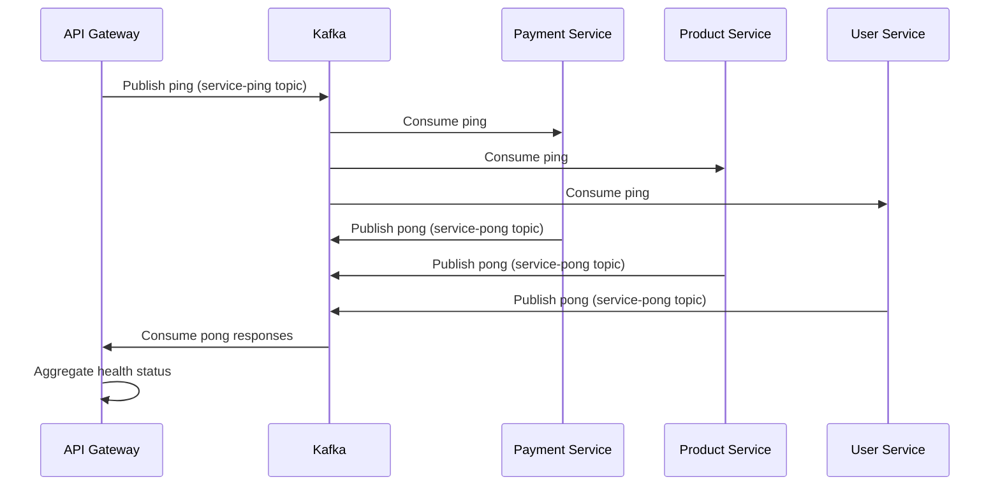

# Architecture Guide

## Overview

MicroCommerce follows a distributed microservices architecture pattern designed for scalability, maintainability, and fault tolerance. This document provides detailed insights into the system design, communication patterns, and architectural decisions.

## System Architecture

### High-Level Architecture

```
┌─────────────────────────────────────────────────────────┐
│                    External Layer                       │
├─────────────────────────────────────────────────────────┤
│  Load Balancer / CDN / WAF                             │
└─────────────────────┬───────────────────────────────────┘
                      │
┌─────────────────────▼───────────────────────────────────┐
│                 API Gateway                             │
│              (Port 8080)                                │
│  - Request Routing                                      │
│  - Authentication                                       │
│  - Rate Limiting                                        │
│  - Service Discovery                                    │
└─────────────────────┬───────────────────────────────────┘
                      │
         ┌────────────┼────────────┐
         │            │            │
         ▼            ▼            ▼
┌─────────────┐ ┌─────────────┐ ┌─────────────┐
│   Payment   │ │   Product   │ │    User     │
│   Service   │ │   Service   │ │   Service   │
│ (Port 8081) │ │ (Port 8082) │ │ (Port 8083) │
└─────────────┘ └─────────────┘ └─────────────┘
         │            │            │
         └────────────┼────────────┘
                      │
              ┌───────▼───────┐
              │     Kafka     │
              │ Message Broker│
              │ (Port 9092)   │
              └───────────────┘
```

## Core Components

### 1. API Gateway

**Responsibility**: Single entry point for all client requests

**Key Features**:
- Request routing to appropriate microservices
- Service health monitoring and aggregation
- Future: Authentication, authorization, rate limiting
- Future: Request/response transformation
- Future: Circuit breaker pattern implementation

**Implementation Details**:
- Built with Go and Gin framework
- Implements health check aggregation via Kafka messaging
- Provides service discovery capabilities
- Maintains service registry for routing decisions

### 2. Payment Service

**Responsibility**: Handle all payment-related operations

**Key Features**:
- Payment processing (future implementation)
- Transaction management
- Payment method validation
- Integration with external payment providers (planned)
- PCI compliance ready architecture

**Current Implementation**:
- Basic health check endpoint
- Kafka consumer for ping/pong health monitoring
- Ready for payment gateway integration

### 3. Product Service

**Responsibility**: Manage product catalog and inventory

**Key Features**:
- Product CRUD operations (planned)
- Inventory management
- Product search and filtering
- Price management
- Category management

**Current Implementation**:
- Basic health check endpoint
- Kafka consumer for health monitoring
- Extensible architecture for product management

### 4. User Service

**Responsibility**: User management and authentication

**Key Features**:
- User registration and authentication (planned)
- Profile management
- User preferences
- Session management
- Role-based access control (RBAC)

**Current Implementation**:
- Basic health check endpoint
- Kafka consumer for health monitoring
- Foundation for user management system

## Communication Patterns

### 1. Synchronous Communication

**HTTP/REST**: Used for direct service-to-service communication where immediate response is required.

```
Client -> API Gateway -> Service (HTTP/REST)
```

**Use Cases**:
- User requests requiring immediate response
- Service health checks
- Configuration retrieval

### 2. Asynchronous Communication

**Apache Kafka**: Used for event-driven communication and decoupling services.

```
Service A -> Kafka Topic -> Service B (Event-driven)
```

**Current Topics**:
- `service-ping`: Health check requests from API Gateway
- `service-pong`: Health check responses from services

**Planned Topics**:
- `order-events`: Order lifecycle events
- `payment-events`: Payment processing events
- `inventory-events`: Stock level changes
- `user-events`: User activity and preferences

### 3. Health Check Pattern

Distributed health checking using Kafka messaging:

1. API Gateway publishes ping messages to `service-ping` topic
2. Services consume ping messages and respond on `service-pong` topic
3. API Gateway aggregates responses and provides overall system health

## Data Flow

### Health Check Flow



## Design Patterns

### 1. API Gateway Pattern

Centralizes external communication and provides:
- Single entry point for clients
- Request routing and load balancing
- Cross-cutting concerns (auth, logging, monitoring)

### 2. Event-Driven Architecture

Services communicate through events:
- Loose coupling between services
- Eventual consistency
- Better fault tolerance
- Scalability benefits

### 3. Health Check Pattern

Distributed health monitoring:
- Proactive service monitoring
- Centralized health aggregation
- Circuit breaker foundation

### 4. Shared Kernel Pattern

Common utilities in `shared` module:
- Environment configuration utilities
- Common types and interfaces
- Reduces code duplication

## Scalability Considerations

### Horizontal Scaling

- **Stateless Services**: All services are designed to be stateless
- **Load Balancing**: Services can be scaled independently
- **Kafka Partitioning**: Message topics can be partitioned for parallel processing

### Vertical Scaling

- **Resource Optimization**: Each service can be tuned for specific resource requirements
- **Container Limits**: Kubernetes resource limits prevent resource contention

### Database Scaling (Future)

- **Database per Service**: Each service will have its own database
- **Read Replicas**: For read-heavy operations
- **Caching**: Redis/Memcached for frequently accessed data

## Security Architecture

### Current Security Measures

- **Service Isolation**: Services communicate through defined interfaces
- **Network Segmentation**: Kubernetes network policies (planned)
- **Environment-based Configuration**: Sensitive data through environment variables

### Planned Security Enhancements

- **JWT Authentication**: Token-based authentication
- **OAuth 2.0/OpenID Connect**: Integration with identity providers
- **API Rate Limiting**: Prevent abuse and DDoS attacks
- **Service Mesh**: Istio for mTLS and advanced security features
- **Secret Management**: Kubernetes secrets or external secret management

## Monitoring and Observability

### Current Monitoring

- **Health Checks**: Built-in health monitoring system
- **Service Status**: Real-time service availability

### Planned Observability

- **Distributed Tracing**: Jaeger or Zipkin integration
- **Metrics Collection**: Prometheus and Grafana
- **Centralized Logging**: ELK stack or similar
- **Performance Monitoring**: APM tools integration

## Deployment Architecture

### Local Development

- **Native Go**: Direct service execution
- **Kubernetes + Tilt**: Container-based development

### Production Deployment

- **Container Registry**: Docker images stored in registry
- **Kubernetes Cluster**: Production-grade orchestration
- **Helm Charts**: Templated deployment manifests
- **CI/CD Pipeline**: Automated build and deployment

## Technology Decisions

### Why Go?

- **Performance**: Compiled language with excellent concurrency
- **Simplicity**: Easy to read and maintain
- **Cloud Native**: Excellent Kubernetes integration
- **Microservices**: Lightweight and fast startup times

### Why Apache Kafka?

- **High Throughput**: Handle millions of messages per second
- **Durability**: Persistent message storage
- **Scalability**: Horizontal scaling capabilities
- **Ecosystem**: Rich ecosystem of tools and connectors

### Why Kubernetes?

- **Container Orchestration**: Production-grade container management
- **Service Discovery**: Built-in service discovery and load balancing
- **Scaling**: Automatic horizontal and vertical scaling
- **Self-Healing**: Automatic restart and rescheduling of failed containers

## Future Architecture Enhancements

### Short Term (Next 3-6 months)

- **Database Integration**: Add PostgreSQL/MongoDB per service
- **Authentication Service**: Implement JWT-based authentication
- **Business Logic**: Implement core e-commerce functionality
- **API Documentation**: OpenAPI/Swagger integration

### Medium Term (6-12 months)

- **Service Mesh**: Istio integration for advanced networking
- **Caching Layer**: Redis integration for performance
- **Event Sourcing**: Implement event sourcing for audit trails
- **CQRS**: Command Query Responsibility Segregation

### Long Term (12+ months)

- **Multi-tenant Architecture**: Support for multiple tenants
- **Advanced Analytics**: Real-time analytics and reporting
- **AI/ML Integration**: Recommendation engines and fraud detection
- **Global Distribution**: Multi-region deployment support

## Performance Considerations

### Current Performance Features

- **Efficient Routing**: Gin framework for high-performance HTTP routing
- **Concurrent Processing**: Go's goroutines for concurrent request handling
- **Minimal Overhead**: Lightweight service architecture

### Planned Performance Optimizations

- **Connection Pooling**: Database connection pooling
- **Caching Strategies**: Multi-level caching implementation
- **Load Balancing**: Advanced load balancing algorithms
- **CDN Integration**: Content delivery network for static assets

## Fault Tolerance

### Current Fault Tolerance

- **Health Monitoring**: Proactive service health checking
- **Service Isolation**: Failures contained within service boundaries
- **Kafka Durability**: Message persistence for reliable communication

### Planned Fault Tolerance

- **Circuit Breaker**: Prevent cascade failures
- **Retry Mechanisms**: Exponential backoff for failed requests
- **Bulkhead Pattern**: Resource isolation
- **Timeout Management**: Prevent hanging requests
